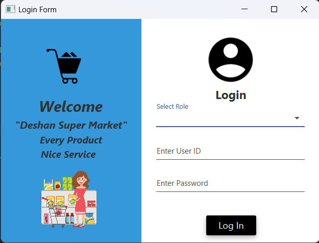

# Super Market (POS)

### What is this ?

A standalone application designed for a supermarket to handle its customer, item
details and it allows the seller to manage the daily tasks more conveniently and
effectively with order details

### Purpose ?

This project is built to learn how to use the layered architecture and learn how to use the JDBC API.

## Built With
#### Languages

• JAVA  

#### Libraries

• JavaFX   
• MySQL Connector   
• JFoenix   

#### Architectures

• Layered Architecture  

